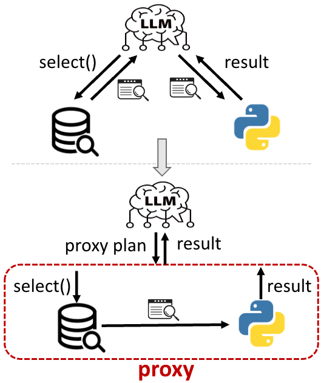

# MCP-Proxy-Execute — Enable Toolchains to Execute Automatically Without LLM as a Relay


---

## Overview  

In automated workflows, tools often need to share intermediate data such as tables, processing results, and structured outputs. When using a Large Language Model (LLM) as an intermediary for this data transfer, two major issues arise:

- **LLM context limitations**: It can't efficiently handle large volumes of data, risking task failure due to exceeding context limits.
- **Low efficiency and error-proneness**: Relaying data through the LLM incurs high computational cost and risks introducing errors due to hallucinations.

To solve these problems, we introduce **MCP-Proxy-Execute**, which provides a `proxy` tool that enables direct and reliable data exchange between tools. The LLM only orchestrates the execution plan without participating in actual data transmission.


<div align="center">



</div>

---

## Core Features  

- ✅ **Automatic Sequential Execution**: Tools are executed in dependency order (e.g., A → B → C), without manual intervention.  
- ✅ **Automatic Parameter Passing**: Resolves input dependencies and automatically transfers results from one tool to another.  
- ✅ **Flexible Data Transformation**: Supports lambda expressions or custom functions to process intermediate results (e.g., field extraction, format conversion).  
- ✅ **LLM-Free Data Flow**: All data is passed directly between tools; the LLM only generates the execution structure.

> 💡 With `proxy`, the LLM evolves from a "data carrier" into a "task coordinator", significantly improving performance and reliability.

---

## Quick Integration  

### Usage in Desktop Applications (Claude, VSCode, Cursor, etc.)

Add the following configuration to your MCP server settings:

```json
{
  "mcpServers": {
    "mcp_proxy_execute": {
      "command": "uvx",
      "args": ["mcp-proxy-exec"]
    }
  }
}
```

---

## Proxy Tool Specification

### Function Signature  

```
def proxy(
    target_tool: str,              # Name of the final tool to execute
    tool_args: Dict[str, Any],    # Parameters for the target tool (supports nested calls)
    server_config: Dict[str, Any] # Configuration for available MCP servers
) -> Any:
    ...
```

### Parameters  

#### `target_tool` (str)  
The name of the final tool to be executed (e.g., `line_plotter`).

#### `tool_args` (Dict[str, Any])  
A dictionary of parameters for the target tool. Each value can be:

- A **literal** (string, number, etc.)
- A **nested tool call**:
  ```python
  {
    "__tool__": "tool_name",
    "args": { ... },
    "identifier": "unique_id",
    "__transform__": "lambda result: processed_result"  # Optional
  }
  ```
- A **reference to a previous identifier**:
  ```python
  {
    "__ref__": "identifier_to_reference",
    "__transform__": "lambda result: transformed_result"  # Optional
  }
  ```

#### `server_config` (Dict[str, Any])  
Configuration for available MCP servers. Example:

```python
{
  "mcpServers": {
    "Server1": {"host": "127.0.0.1", "port": 8001},
    "Server2": {"host": "127.0.0.1", "port": 8002}
  }
}
```

### Return Value  

- Returns the output of the final executed tool (`target_tool`).
- If any error occurs during execution (e.g., duplicate identifiers, missing dependencies, transform errors), an exception is raised.

---

## Usage Examples  

### Example 1: Two-Level Dependency  

```
proxy(
    target_tool="line_plotter",
    tool_args={
        "x": {
            "__tool__": "SELECT",
            "args": {"query": "SELECT timestamp, sales_amount FROM sales_data"},
            "identifier": "select_sales_data",
            "__transform__": "lambda data: [row[0] for row in data]"
        },
        "y": {
            "__ref__": "select_sales_data",
            "__transform__": "lambda data: [row[1] for row in data]"
        }
    },
    server_config=your_server_config
)
```

### Example 2: Multi-Level Nested Dependency  

```
proxy(
    target_tool="line_plotter",
    tool_args={
        "x": {
            "__tool__": "data_processor",
            "args": {
                "raw_data": {
                    "__tool__": "SELECT",
                    "args": {"query": "SELECT timestamp, temperature FROM sensor_readings"},
                    "identifier": "sensor_data_query",
                    "__transform__": "lambda data: [row[0] for row in data]"
                },
                "method": "smooth",
                "window_size": 5
            },
            "identifier": "processed_x_data"
        },
        "y": {
            "__tool__": "data_processor",
            "args": {
                "raw_data": {
                    "__ref__": "sensor_data_query",
                    "__transform__": "lambda data: [row[1] for row in data]"
                },
                "method": "filter_outliers",
                "threshold": 3
            },
            "identifier": "processed_y_data"
        }
    },
    server_config=your_server_config
)
```

---

## Best Practices for LLM

- 📌 Use unique `identifier`s to avoid conflicts.
- ⚙️ Leverage `__transform__` to preprocess or reshape data before passing it to the next tool.
- 🔄 Keep tool logic clean and focused; let the proxy manage dependencies.
- 📦 Avoid hardcoding server configurations; load them dynamically or from environment variables.

---

## Extending the Proxy  

For advanced usage or customization, refer to the implementation details in `mpe/server.py`. You may extend the proxy's behavior by:

- Adding support for new types of parameter references.
- Integrating additional transformation mechanisms.
- Implementing logging or tracing features for debugging complex chains.

---

## Contributions  

We welcome contributions! Please read our contribution guide and submit PRs or issues on GitHub.

---

## Contact  

For questions or collaboration, feel free to reach out via:

📧 Email: [lianggui.wlg@alibaba-inc.com]  
🔗 GitHub: [github.com/your-org/mcp-proxy](https://github.com/your-org/mcp-proxy)

---
